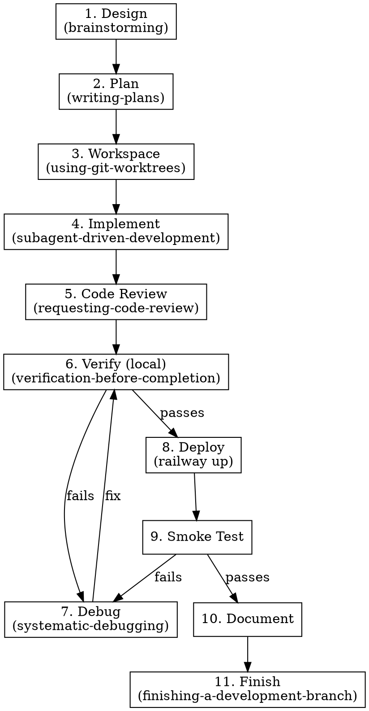

# Full-Cycle Development

## Overview

Orchestrates every superpowers skill into a pipeline from idea to deployed, documented feature. The pipeline has two verify-debug cycles that loop until clean: one before deploy (local) and one after deploy (smoke test). Only advance past a gate when `verification-before-completion` confirms pass with evidence.

**Core principle:** Verify-debug loops until clean. No stage skipped without justification.

## Pipeline



## Stages

### 1. Design — `brainstorming`

**Entry:** Idea or request from user.
**Exit:** Approved design doc in `docs/superpowers/specs/`, committed.
**Skip when:** Design already exists and is approved.

### 2. Plan — `writing-plans`

**Entry:** Approved design doc.
**Exit:** Implementation plan in `docs/superpowers/plans/` with ordered TDD tasks. No placeholders.
**Skip when:** Plan already exists and is approved.

### 3. Workspace — `using-git-worktrees`

**Entry:** Approved plan.
**Exit:** Worktree ready. Clean test baseline on feature branch.
**Skip when:** Already on a feature branch with clean tests.

### 4. Implement — `subagent-driven-development`

**Sub-skills:** `test-driven-development` for each task. `dispatching-parallel-agents` when tasks are independent.

**Entry:** Plan and workspace ready.
**Exit:** All tasks complete. Two-stage review passed (spec + quality).

### 5. Code Review — `requesting-code-review` then `receiving-code-review`

**Entry:** Implementation complete.
**Exit:** No Critical or Important issues remaining.
**Skip when:** Solo micro-change with no architectural impact (justify explicitly).

### 6. Verify (Local) — Cycle Gate

**Skill:** `verification-before-completion`

**Entry:** Code review passed.
**Process:** Run `bun check`, run all modified tests, verify requirements line-by-line.

**On pass:** Advance to Stage 8 (Deploy).
**On fail:** Go to Stage 7 (Debug), then return here. Repeat until clean.

**Do not skip.**

### 7. Debug — `systematic-debugging`

**Entry:** Verification or smoke test failed.

**Process:** Follow systematic-debugging four phases: root cause → pattern analysis → hypothesis → implementation (TDD). If 3+ fixes fail, stop and question architecture.

**After fix:** Return to Stage 6 (Verify). Never skip re-verification.

**When entered from Stage 9 (smoke test):** Fix locally, verify locally (Stage 6), re-deploy (Stage 8), re-smoke-test (Stage 9).

### 8. Deploy

**Entry:** Local verification passes.
**Process:** `railway up` from repo root. Poll until SUCCESS. Verify `/health` returns 200.
**Exit:** Deployment URL accessible, health check 200.
**Skip when:** `RAILWAY_TOKEN` not configured.

### 9. Smoke Test — Cycle Gate

**Entry:** Deployment live and healthy.
**Process:** `bun run smoke-test`. Verify AI judge verdict is "pass".

**On pass:** Advance to Stage 10 (Document).
**On fail:** Go to Stage 7 (Debug), then cycle through Stage 6 → Stage 8 → back here.

**Skip when:** Deploy was skipped (cascade from Stage 8).

### 10. Document

**Entry:** Smoke tests pass (or local verification passes if deploy skipped).

**Both codebase and user-facing docs must be in sync:**
- Codebase: inline comments, README, architecture docs
- User-facing: user guides, config docs, changelog
- Remove docs for deleted features (no forwarding addresses)
- Sync check: every new env var, CLI command, and API change appears in both

**Exit:** No undocumented features, env vars, or commands. No drift between codebase and user docs.
**Skip when:** No user-facing or API changes.

### 11. Finish — `finishing-a-development-branch`

**Entry:** Documentation complete.
**Exit:** Branch merged or PR created. Worktree cleaned up.

## The Two Cycles

**Cycle 1 — Pre-Deploy (Local):**
```
Verify ──fail──→ Debug ──→ Verify ──fail──→ Debug ──→ ...
                      │
                      └──pass──→ Deploy
```
Runs `bun check` + tests + requirements. No deployment until green.

**Cycle 2 — Post-Deploy (Smoke):**
```
Smoke ──fail──→ Debug ──→ Verify ──pass──→ Deploy ──→ Smoke ──fail──→ ...
                                                            │
                                                            └──pass──→ Document
```
Runs `bun run smoke-test` against live deployment. Cycles back through local verify + redeploy.

**Why two cycles?** Local verification catches type errors, lint failures, and unit test regressions before wasting a deployment. Smoke testing catches integration failures and environment mismatches that only surface in production.

## Skipping Rules

| Stage | Skip When |
|-------|----------|
| 1. Design | Approved design doc already exists |
| 2. Plan | Approved plan already exists |
| 3. Workspace | Already on feature branch with clean tests |
| 5. Code Review | Solo micro-change, no architectural impact |
| 8. Deploy | `RAILWAY_TOKEN` not configured |
| 9. Smoke Test | Deploy skipped (cascade) |
| 10. Document | No user-facing or API changes |

**Never skip:** 4 (Implement), 6 (Verify), 11 (Finish).

State which stages are skipped and why.

## Common Mistakes

- Deploying before local verification — Cycle 1 must be green
- Declaring "tests passed earlier" — verify FRESH
- Proceeding past smoke test failures — Cycle 2 must be green
- Skipping re-verification after debugging — always return to Verify
- Guessing fixes instead of systematic debugging — use the skill
- Writing codebase docs without syncing user-facing docs